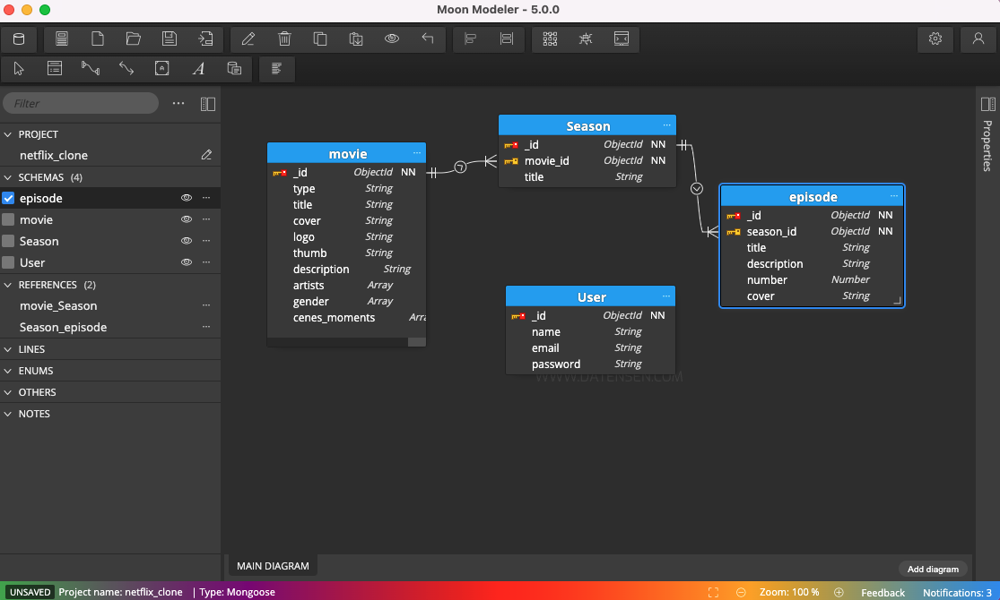

# Netflix Backend clone with Node.js

Domaing Driven Design (DDD) + BDD (Behavior Driven Development) + MongoDB implementation

### Tests

```js
npm run test
```

### Running

```js
npm install
npm run dev
```

#### MongoDB MER



### Routes

#### Post Movie

http://localhost:3001/movies

```json
{
	"type": "calaca",
	"title": "calaca@test.com",
	"cover": "112334",
	"logo": "asdf",
	"thumb": "asdf",
	"description": "asdf",
	"artists": ["asdf", "asdf"],
	"gender": ["asdf", "asdf"],
	"cenes_moments": ["asdf", "asdf"]
}
```

#### Post Season

http://localhost:3001/seasons/63558b15a43e1e255fbdb6fe

```json
{
	"title": "calaca@test.com"
}
```

#### Post Episode

http://localhost:3001/episodes/63558bfa6b42b510b9cf82fb

```json
{
	"title": "calaca@test.com",
	"description": "asdf",
	"number": "654",
	"cover": "cover.png"
}
```
